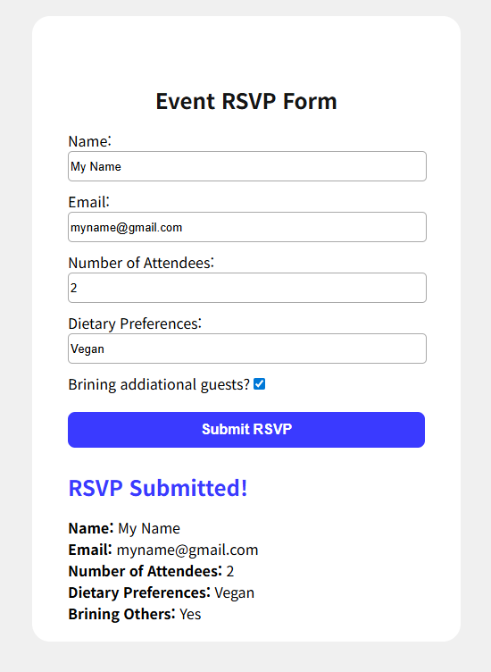

# Event RSVP Form (React + CDN)

A lightweight Event RSVP form built with **React 18** using **CDN scripts** (no Vite / no bundler). Users can fill out event details and, upon submission, see a confirmation summary displayed in the same card. The form container expands on submit to reveal the confirmation message.

---

## Live Website

🔗 https://riiach.github.io/RSVP-Form/

---

## Preview



---

## Features

- Controlled inputs with React `useState`
- Required field validation (Name, Email, Attendees)
- Toggle checkbox for bringing additional guests (Yes/No)
- Prevents page reload on submit (`e.preventDefault()`)
- Confirmation message appears below the form after submission
- Form card height expands when submitted (`.form-container.submitted`)
- Clean, centered UI with hover effects on the submit button

---

## Tech Stack

- HTML / CSS
- React 18 (CDN)
- ReactDOM 18 (CDN)
- Babel Standalone (CDN) for JSX in the browser

---

## Project Structure

```txt
.
├── index.html
├── styles.css
├── index.jsx
└── assets/
    └── preview.png
```
---

## 👤 Author

**Ria Choi**
💼 www.linkedin.com/in/ria-choi-76a658309
📧 riiachoii@gmail.com

If you like this project, consider ⭐ starring the repo!
